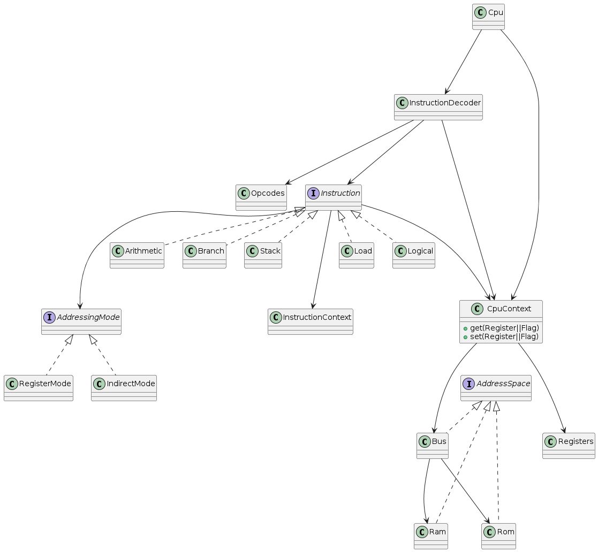

# Gameboy Emulator
## Short description
An emulation of the original Gameboy console in Java.

## Table of Contents
[Currently implemented features](##features)

[Intended features yet to be implemented](##intended-features)

[If you are a prospective employer, please go here to see a summary of notable skills that this project showcases](##for-potential-employers)

[What a big project! How do I navigate this?](##how-to-navigate-the-project)

[Roadmap](##roadmap)

## Features
- Emulation of the Sharp LR35902 that the original Gameboy uses
- Basic Memory Bus
- A test run of Bubble Sort to showcase that the CPU works

## Intended Features
- CPU interrupts
- Audio
- Gamepad
- Graphics

## For Potential Employers

## Class Diagram

## How to navigate the project

## Roadmap
