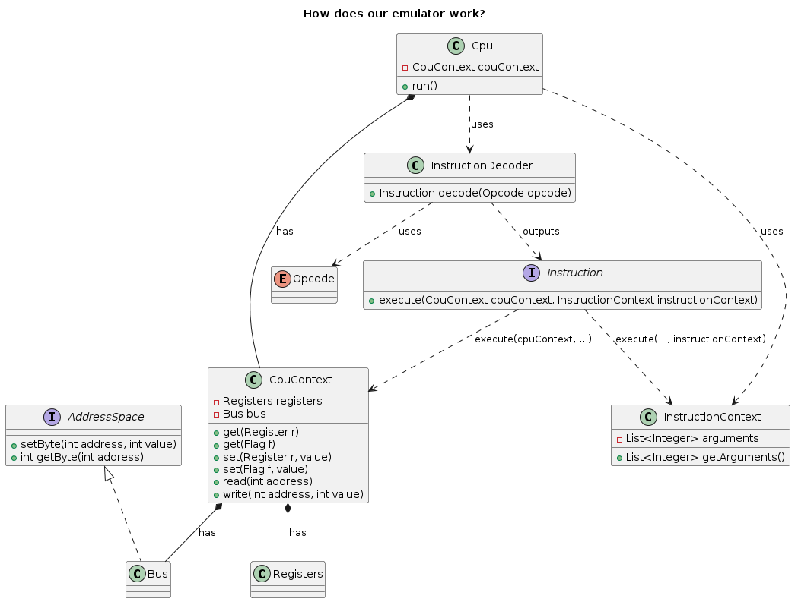

# Gameboy Emulator

## Short description
An emulation of the original Gameboy console in Java.

## Table of Contents
- [Currently implemented features](#features)
- [Intended features yet to be implemented](#intended-features)
- [If you are a prospective employer, please go here to see a summary of notable skills that this project showcases](#for-potential-employers)
- [What a big project! How do I navigate this?](#how-to-navigate-the-project)
- [Why did I do some of the things that I did?](#why-did-I-do-it?)
- [This looks cool! How do I run it?](#how-to-run)
- [Project Roadmap](#roadmap)

## Features
- Emulation of the Sharp LR35902 that the original Gameboy uses
  + Some of the instruction is still missing. They are listed below.
    - Branch instructions except relative jumps
    - A few arithmetic instructions involving immediate values
    - Misc/Control instructions
    - Instructions involving the Stack Pointer
    - Extended Opcodes
- Basic Memory Bus
- A test run of Bubble Sort to showcase that the CPU works

## Intended Features
- CPU interrupts
- Audio
- Gamepad
- Graphics
- Ability to run games
- Save State

## For Potential Employers
To be added...

## How to navigate the project
### Overview
The flow of the program as follows.
As the user, we initialise the context of the CPU and create a CPU with said context.
The context is the state of the CPU. For now, it comprises the working RAM, the ROM, the memory bus to manage them and the registers.

`
Bus bus = new Bus(new Wram(), new Rom(instructions));
CpuContext cpuContext = new CpuContext(new Registers(), bus);
Cpu cpu = new Cpu(cpuContext);
`

Here is a simplified flow of how our CPU emulator works. You can check out the code for more details.

1. First, we initialize the CPU context. This also means loading a Rom into the bus with the instructions we'd like to run.
2. Now we call cpu.run()
3. The CPU first gets the next instruction from the memory space, more specifically the Rom.
4. It then passes the instruction, which is an 8-bit integer, to the InstructionDecoder which returns an instance of the interface Instruction.
5. Then the CPU checks if the Instruction takes any arguments. If so, we read the next 1-2 bytes depending on the instruction and then create the InstructionContext to wrap around these arguments.
6. Then we call execute() on the instruction with the CPU context and the instruction context as arguments.
7. We increment the program counter accordingly and repeat.

Here is the overview diagram of all the major components involved in the running of the CPU.
We dive into some of them more deeply in the next sections.

### Decoding Instructions

The Instruction Decoder is an application of the Factory Pattern.
It takes an integer as the input and returns an implementation of the instruction.

The Instruction interface is implemented by many classes and this diversity reflects the variety of instructions in the instruction set.

The constructor of an implementation of Instruction that involve moving bytes/words between the register space and the memory space will either have one or two parameters : the source addressing mode and the destination addressing mode.

Addressing mode abstracts away the logic of the actual reading of the source or the actual writing of the destination.
As terminal implementations, we have
1. ImmediateByteMode and ImmediateWordMode for opcodes taking one or two arguments respectively
2. RegisterMode for when we want to read/write directly from/to the contents of a register
3. IndirectMode for when we want to use the contents of a register to address the memory bus

Currently, AddressingMode is utilised by Arithmetic Instructions and Load Instructions.

Branch instructions however require different handling. Similarly to Addressing Modes, we have Branch Modes that are intended to abstract away the logic of checking the flags of the CPU.
Currently, we have
1. ImmediateBranch for when we want to jump straight away without checking anything
2. Carry/NotCarry for checking if the Carry flag is set
3. Flag/NotFlag for checking if some flag is set for all remaining flags.

You may be asking yourself why I am separating Branch Modes and Addressing Modes from the Instruction classes. Go here for an explanation.

Here is a class diagram to get a bird eye's view of the instructions and the modes.

### Opcodes

For the reader's convenience and mine, I have decided to wrap the CPU instruction opcodes into a single file. You can check these out in `Opcode.java`.
Now, instead of typing out the hex values tediously, we can simply write something like `Opcode.LD_A_D8.getValue()` to get the integer value.
This has simplified development a lot!

### Bubble Sort

The project by default runs a somewhat customizable Bubble Sort run implemented in `App.java`.
Since we don't have the `CALL` instructions yet, the relative jumps have been hardcoded sadly.
I am not happy either but you can check out the instructions I have handwritten there to figure out how to write your own set of instructions that you can plug into the emulated CPU.

## Why did I do it?
In this section, I outline the reasoning behind some of the engineering decisions I made in this project. If you have any feedback, please email me at.

## How to run

1. Clone the project
2. Go to the root of the project folder
3. Run `mvn compile assembly:single`
4. Run the jar file with `java -jar target/gameboy-app-1.0-SNAPSHOT-jar-with-dependencies.jar`
5. Enjoy!

## Roadmap
To be added...
